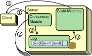

### 概要
Raft是一个管理可复制的日志的一致性协议。它在效率和结果上合Paxos类似，但和Paxos结构不一样。这使得Raft比Paxos更好理解，而且为创建实用的系统提供更好的基础。为了提高可理解性，Raft区分了一致性协议的关键元素，比如，leader选举，log复制，和安全性，而且他强制实施了一个更强的一致性协议，为了减少分布式中必须被考虑的节点状态。一个使用结果显示，对学生来说，Raft比Paxos更容易学习。Raft为改变集群成员，提供了一个新的机制，这个机制同样大部分也被用于保证安全。
### 1 简介
一致性算法允许一组机器连贯一致的工作，并允许其中几个机器出现问题。因为这个特性，它是创建一个可依赖的大规模的分布式软件系统的一个关键因数。Paxos在过去10年统治了一致性算法的论述。大多数一致性算法的实现基于Paxos，而且已经是教育学生一致性算法一个主要的参考。

不幸的是，Paxos非常难理解，尽管有很多人尝试改进这一点。而且，实际系统中需要对它的架构进行许多改变。结果，系统架构师和学生都很艰难的实施Paxos.

经过对Paxos一段时间的艰难的学习，我们发现了一种新的一致性协议，可以未系统创建和学生提供更好的基础。我们的实现方式和不寻常，我们的首要目标是可理解性:我们是否可以为实际的系统定义一种一致性算法，可以比Paxos非常简单的描述它？而且我们希望这种算法可以增强开发者的必要的分布式系统开发的直觉。这种算法不仅是可以工作，更重要的是非常清晰的表明为什么他能工作。

这项工作的结果最终形成了一致性算法Raft。Raft的设计中，为了增加可理解性，我们加入的详细的技术包括分解（Raft分来了，leader选举，log复制，安全）和简化状态空间（和Paxos相比，Raft缩减了一致性协议，和Server之间的异常状态）。两所大学43名学生的使用表明Raft比Paxos更容易学习，通过对算法的学习，33名学生可以说出Raft比Paxos好的地方。
  Raft和其他已执行算法有很多相似的地方，但它有几个与众不同的地方：
* 更集权的leader:Raft的leader和其它一致性的算法相比有更加集权，比如日志实体只能从leader传输到其它server，这简化的日志复制的管理，是raft跟好的理解
* leader选举：Raft使用随机的定时器去选举leader。这对于任何的一致性算法来说只增加了一些heartbeats机制，但是方便，快速的解决了冲突的问题
* 成员变更：Raft集群内成员变更策略是使用一个新的关键节点一致接近的算法，两个不同的配置在过渡期部分重叠（TODO）.这使得集群在变更是可以继续正常执行。

我们相信Raft比Paxos和其它一致性算法更好，在教育用途和商业实现用途。它比其他算法更简单，更容易理解。对于一个实际的系统来说，它描述了所有的需求。它已经有好几个开源实现，和几家公司在使用了。他的安全性已经被正式的描述和证明了。他的效率比得上其它算法。

下面的章节介绍了负责状态机器问题(第2章)，讨论paxos的优缺点（第三章），讨论我们在可理解性上的努力（第四章），介绍Raft一致性算法（5-8章），评价Raft（第9章），讨论最近工作（第10章）。
### 2 复制状态机
一致性算法典型的会产生复制状态机器的背景。在这个背景中，一组机器的状态机从相同的状态中计算出典型的状态，可以在一些机器挂掉的时候继续执行。复制状态机用于在分布式系统中处理一系列可以容忍的错误。比如，像GFS, HDFS,RAMCloud这些只有一个leader的大规模分布式系统，使用一个单独的复制状态机去管理leader选举，并保存复制信息是集群能从leader挂掉的情况中恢复过来。同样的例子还有Chubby和ZooKeeper。
  
图表1:复制状态机结构。一致性算法管理1个复制日子，包含从客户端来的复制状态机的命令。复制状态机从日志中处理一致的相同的命令，所以他们产生相同的结果。

复制状态的记得实现是主要是通过复制日志，如同上图所示。每一个server保存包含一系列命令的日志，供它的状态机按一定顺序执行。每一个日志按相同的顺序保存相同的指令，所以每一个复制状态机处理相同系列的命令。因为复制状态机是确定的，所以每一个都会计算出相同的结果，因为相同的命令输入。保持复制日志一致性是一致性算法的工作。server的一致性模块接收client的指令并把它添加到日志里。然后和其它server的一致性模块交流最终保证每一个server包好相同顺序呢的相同的请求的日志，技术有几个server挂掉了。一旦请求正确的复制了，每一个server的复制状态机，通过日志顺序执行请求，并把输出返回给client。所以，server集群表现的跟一个单独的高度可以来的状态机一样。

典型的实际系统的一致性算法有以下几个特点：
* 在所有不复杂错误情况下，保证安全（不返回不正确的结果），包括，网络延迟，网络断开，丢包，重复，和重排序。
* 只要主要的server可以运行，可以和其它server和client通信，整个集群都可以正常工作。因此，一个正常的5server的集群可以容忍2个server宕机。当server停止时就会被当做宕机。他们可能在一段时间后从硬盘重启，并重新接入集群。
* 不通过时间保证日志的一致性，有缺陷的闹钟和异常延迟的信息最坏可以影响可用性。
* 正常情况下，当大多数server相应这一轮远程呼叫后，一个请求可以被认为完成，少量的慢机器不会影响整体集群的性能。
### 3 Paxos的缺陷
过去10年中Leslie Lamport的Paxos协议几乎代表了一致性算法：在课程中实用的最普遍，大多是一致性实现以它为起点。Paxos首先定义了单一请求的一致性协议，比如单一复制日志。我们参考这一单一法令Paxos。然后Paxos使用多个单一请求的实体，来实现一系列请求的一致性，比如日志（Muitu-Paxos）。Paxos保证了系统的存活和安全，它支持集群成员的变更。它已经被证明可行，而且在正常情况下高效。

不幸的是，Paxos有两个缺点。第一个缺点是Paxos异常的难以理解。官方解释十分不透明。只有少数十分努力的人才能理解他。所以有一些人尝试用更简单的方式描述他，这些描述集中在单一法令（single-degree）方面，而且现在这些描述还不完善。一份对2012NSDI的出席者的非正式的调查显示，很少有人对Paxos满意，即使是那些专门的研究人员。我们也很费力的理解Paxos。直到阅读了好几份对Paxos的简化说明，并设计我们的替换的协议，我们才能够理解完整的协议，这花了将近1年。

我们假设Paxos之所以难理解是因为他单一法令(single-degree)作为他的基础。单一协议(single-degree)Paxos是复杂的和细微的。它被分为两个阶段，并且都没有很好地简单的可以凭直觉的解释，而且两个阶段不能单独的理解。因为这样，很难直观的理解为什么单一法令(sigle-decree)协议能起作用。Muitu-Paxos的构成规则明显的增加了复杂度和不透明度。我们相信多请求的一致性的总体问题可以用一种其他的更直接的更明显的方式分解。
  
Paxos的的二个缺点是他没有为实际系统的实现提供很好地基础。其中一个原因是Multi-Paxos没有一个广泛的约定算法。Lamport的描述主要集中于单一法令(single-degree)Paxos。他简要的描述了Multi-Paxos，但是缺少很多细节。有其他一些尝试分解和优化Paxos,但他们之间和Lamport的描述都不一样。Chubby这个系统实现了一个类Paxos的算法，单算法的细节没有公布出来。

而且Paxos的架构不适合搭建实际的系统；单一法令（single-degree）的分解有另一个后果。比如单独的取出每一个日志实体在融合成一个有顺序的日志，这个操作的用处很小；这只会增加复杂度。更简答更有效地方法是围绕日志建立一个系统，新的实体以严格的顺序有序的插入。另一个问题是Paxos使用对称的点对点的协议作为核心（尽管作为性能优化，它建议一个弱的领导系统）。这在单一请求的情况下是可行的，但现实系统很少是单一请求的。如果有一系列的请求，更简答更快速的方式是选举一个leader，然后让leader协调请求。

所以，实际的系统只实现了Paxos一小部分。每一个实现都是从Paxos开始，发现很难实现，然后开发了一个明显不同的架构。这很耗时而且同意犯错，而且Paxos的难理解性加剧了这个问题。Paxos的架构很好地证明了自己的定理，但是实际的实现跟Paxos差别很大，Paxos的证明又很少的作用。下面的Chubby的Paxos的实现的评论很典型：

Paxos算法的描述跟实际系统的需求差别很大...所以系统最后的实现依据的是未经证明的算法。

因为以上这些问题，我们推断Paxos没有为教育和实际系统提供一个很好的基础。因为一致性协议在分布式系统中很重要。所以我们尝试设计一种可以替换Paxos的比Paxos更好的一致性协议。所以产生了Raft。
### 4 为了可理解行而设计 
在设计Raft的时候我们有好几个目标：它必须未系统搭建提供完整的实际的基础，可以明显的减少开发者的架构设计工作。他必须在任何情况下都安全，在典型的操作情况下可用，对普通的操作是高效的。但是我们最重要的任务，也是最困难的任务是可理解性。对大多数使用在来说它是容易理解的。此外它必须可以增强对算法的直觉，这样系统设计人可以方便的做实际实现中不可避免的扩展。

在Raft的设计中有很多的关键点，我们必须在这个替换协议中选择。在这些情况下我们通过可理解性评价这些可以选择的方案：每一个方案解释起来有多苦难（比如他的状态空间有多复杂，是否有隐藏的情况），读者完全明白这个协议和他的意义。

我们明白这些解释有很高的客观性。尽管如此，我们恰当的运用了两种方法。第一个常见的方法是问题分解：我们尽可能的把问题分成单独的小问题，这些问题几乎可以单独的理解，解释，解决。比如，在Raft中我们分解了，leader选举，日志复杂，安全性，和成员变更。

另一个方法是通过减少需要考虑的状态来简化状态空间，是系统更加连贯，尽可能的消除不确定性。特别的是，日志不能出现空缺，Raft限制了server之间日志不一致的情况。尽管大多数情况下，我们尽可能的消除不确定性，有些情况下不确定性增加的可理解性。特别是，随机协议增加了不确定性，单数他们却能减少状态空间，通过相同的方式处理类似的情况（随便选，无所谓）。我们使用随机来简化Raft leader 选举算法。
