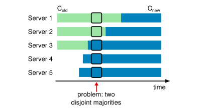
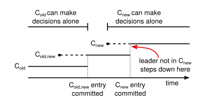
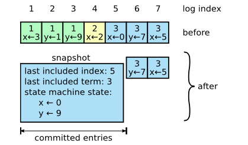
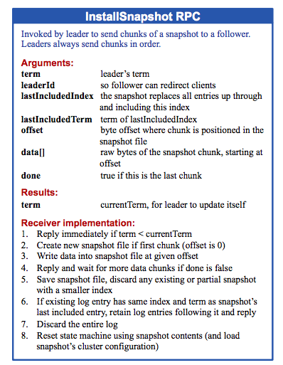

### 6 集群成员变更

图表10：直接从一个配置改到另一个是不安全的。因为不同的server可能在不同的时间切换。在这个例子中，集群从3个涨到5个。不幸的是，这个点可能会在相同的term中产生两个leader，一个得到了 old cluster的大多数选票，一个得到了 new cluster的大多数选票。

直到现在，我们一直假定集群的配置是固定的（参与一致性算法的serder是固定的）。在实际中，偶尔需要改变集群的配置，比如，当server宕机的时候替换他们，或者改变复制的等级。尽管可以通过停止所有的机器，更新配置文件，然后在重启集群来实现，这会导致集群在这期间不可服务。此外，如果存在手工操作，就可能出现操作失误，为了避免这么错误，我们决定自动化配置变化，并把它们纳入raft的一致性协议中。

为了保证配置变化的安全性，必须要杜绝在同一个term中两个leader被选举出来的情况。不幸的是，任何server想要从老的配置转换到新的配置的行为都是不安全的。不可能原子性的一次性的切换所有的server，所以集群可以潜在的把过渡期分为两个独立的阶段（见图表10）.

为了保证安全性，配置切换必须用两个阶段。有很多种方式实现两个阶段。比如，一些系统用第一阶段来封闭就的配置，这样它不会处理client的请求；然互第二个阶段，启用新的配置。在raft中，集群首先切换的过渡期的配置，我们称为 joint consensus；一旦joint consensus 提交了，集群在开始过度到新的配置；joint consensus 链接了 就配置和新配置：

* 两个配置阶段，日志都会被复制到任何server
* 两个配置阶段，任何server都可能称为leader
* 两个配置阶段，协议（选举和日志提交）需要不同的大多数

图表11：配置变换的时间线。虚线展示了创造出来单还没被提交的配置实体，实线表示最近被提交的日志实体。leader首先创造出Cold-new配置实体，并提交到Cold-new（C-new的大部分和C-old的大部分）中。然后创造C-new的配置实体，提交到C-new的大部分，所以不可能有C-new和C-old独立的做决定的时间。

joint consensus 允许不同的server在不同的时间过渡两个阶段，有不损失安全性。而且，joint consensus允许集群继续服务client的请求，在整个配置变更的时间。

集群配置存储在复制日志的也是实体，并通过这个交流。图表11表明了配置切换的过程。当leader收到请求把配置从C-old切换到C-new的时候，leader把joint consensus（C-old-new 如图表中展示的）存储在日志实体中，并通过先前的机制复制这个实体。一旦server把新的配置实体添加到自己的日志，它就会依赖新的配置做所有的操作（server永远在日志中使用新的配置，不论实体是否提交了）。这就意味leader会使用C-old-new的规则判断C-old-new的实体是否被提交了。如果leader宕机了，新的leader可能在C-old或则C-old-new下被选出，主要取决于被选出来的候选人是否收到了C-old-new。任何情况下，C-new都不能单独的做出任何决定。

一旦C-old-new被提交了，C-old和C-new都不能别的server没允许的情况下做决定，而且 Leader Completeness Property保证了只有收到了C-new-old的server才能被选为leader。这时leader创建描述C-new的日志实体，并把它复制到其它server才算安全的。同样，这个配置主要收到就会立即生效。当新的配置在C-new的规则下被提交了，就得配置就无关紧要了，不再新的配置中的机器会被关掉。如图表11展示的那样，C-old和C-new不可能同时做决定，这保证了安全性。

还有三个需要在切换配置注意的地方。第一个是新的server刚启动可能没有保存任何日志信息。如果他们在这个状态下加入了集群，他们要跟上要花一点时间，这段时间他们可能没办法提交新的日志。为了避免这个不可用的间期，在切换配置前，raft引用了一个额外的阶段，这个阶段中新的server作为不可投票的成员加入集群（leader给他们负责日志，但是他们不算大多数的一员）。当新的server跟上了其他server的步伐，就会进行上面描述的切换配置的过程。

第二个是leader可能不在新的配置中。这种情况下，一旦leader提交了C-new的实体，leader会退一步（返回的follower的状态）这就意味着有一段时间，leader管理者自己不属于的集群；负责日志是他不属于大多数的范围。leader的过渡期发生在C-new被提交的时候，因为这个时候，新的配置该开始独立的操作了（它只会选举在C-new的server作为leader）。在这个阶段前，只有在C-old的server才能被选为leader。

第三个是移除server（不在C-new的server）可能一会扰乱集群。这些server不会收到心跳信息，所以他们会超时，并发起新的选举。他们会发起新的term的RequestVote Rpc ，这会导致现在leader退回到follower状态。新的leader会被选举出来，但是被移除的server会再次超时，并重复上面的操作，造成集群的低可用性。

为了防止这种情况，当他们相信当前的leader存在时，他们忽略RequestVote Rpc。当一个server在收听到的当前的leader的最小的选举超时收到了RequestVote Rpc，他不会更新的自己的term，并投票。这不会影响正常的选举，每一个server会在等待一个最小的选举超时后发起一个选举。这避免了被移除的server对集群的扰乱。如果leader能够把自己的心跳发送给集群，他就不会被一个更高的term的废黜掉。

### 7 日志压缩

raft的日志在跟client交互的时候不断增加，但是在实际系统中，他不可能没限制的增加。随着日志的增长，这需要更多的空间，和更多的时间来恢复。没有机制来清除日志中堆积的无用的日志，这会造成系统额不可用。

快照是压缩的最简单的实现。在创建快照时，当前的系统状态被写到快照中，并写到硬盘里面。然后这点之前的日志被丢弃。Chubby 和ZooKeeper 使用快照，这章剩下的部分讨论raft的快照。

递增式的日志压缩，比如 log cleaning，和 log-structure merge tree，也是可行的。这些每次都操作一小部分数据，所以他们把压缩的压力平均的分配下来。首先选出来一小部分可能删除，或者覆盖对象的日志，然后把这部分存活的对象更简洁的重新，然后释放这部分日志。跟快照比起来这需要很多额外的机制和复杂度，快照把这些简化成，只是简单的操作整个数据组。然而日志清理需要对raft进行修改，状态机可以使用LSM tree，使用跟快照一样的接口。

图表12：server把它的提交的日志（index1到5）替换为一个快照，快照只保存当前的状态（这个例子中的x和y）。快照保存压缩日志的最后一个的index和term

图表12展示了raft得快照的基本原理。每一个server独立的做快照，只针对被提交的日志。大多是的工作时状态机把它的状态写入快照。raft也会把一部分的元信息写入快照：最后的日志的index是快照覆盖的日志的最后一个实体的index（状态机最后执行的日志实体），最后的term也是这个实体的term。保存这些是为了支持快照后面的第一个日志实体的一致性检查，因为日志实体需要上一个index和term。为了保证集群成员变化（第6章），快照也要保存最后一个日志实体时的集群配置，当server完成了快照后，它会删除前面的所有的日志，和快照。

尽管server独立的进行快照，leader必须偶尔的被落后的server发送快照。这发生在leader已经抛弃了下一个它要发送被日志实体。幸运的是，这种情况不是正常操作照成的：跟leader保持同步的follower已经有了这个实体。然而一个意外缓慢地follower，或者一个新加入的server不会这样，为了让这些follower up-to-date，leader必须也要给这些follower发送快照。

图表13：安装快照的rpc的总结。快照被分块传递；这也会给follower leader存在的暗示，重置follower的选举定时器。

leader会发送一个新的rpc叫做InstallSnapshot，来给落后的follower发送快照；见图表12，当一个follower通过这个rpc收到快照时，它必须决定怎么处理已存在的日志。通常快照会包含接受者不存在的日志实体。这样，follower抛弃它的整个日志，会全部被快照取代，包括未提交的日志，和冲突的日志。如果follower收到了快照的前一部分（因为tcp错误的重试），被快照覆盖的日志会被删掉，快照后面的日志要保留，因为那还是有效地。

快照的规则是从raft的，因为follower盲目的接受leader的快照，不去询问leader的情况。然而，我们认为这个出发点是对的。leader可以帮助避免一致性的冲突，在进行快照是，已经达到了一致性，所以不会有冲突的决定。数据还是只从leader导向follower，只是follower下载可以重新组织数据。

我们考虑过另一个leader-base的实现，只有leader可以创建快照，并把快照发送给其他follower，然而这有两个不理条件。首先，给每个follower发送快照会浪费带宽，并减缓快照的速度，每一个follower已经有足够的信息来产生自己的快照。follower根据自己的状态自己创建一个快照，比通过网络接受一个，更方便。其次，leader的实现就会更复杂。比如，leader不许并行的发送快照，还要写到日志实体，这样才不会阻塞client的请求。

还有两个问题影响快照的性能。首先，server必须决定什么时候进行快照。如果快照过多，会浪费硬盘带宽，和使用。如果快照过少，会浪费硬盘容量，在重启是也会影响速度。一个简单的策略是当它达到一个固定的值时开始快照。如果这个值明显大于快照期望的值，使用硬盘带宽会很小。

第二个影响性能的是，写快照会需要一段时间。而我们不期望影响正常的操作时间。解决的方法使用copy-on-write方法，所以新的更新会被接受，而不影响快照的写入。比如，带有功能性数据结构的状态机可以实现这点。另外，操作系统（Linux）也可能支持copy-on-write，就可以实现整个状态机的内存快照（我们的实现使用这种协议）。

### 8 client交互
这章描述client怎么跟raft交互。包括client怎么发现集群leader，raft怎么支持线性的语义。这些问题出现在任何一致性的系统中，raft的解决方法跟别的系统类似。

raft的client把所有的请求都发送给leader。当client启动时，它随机的链接一个server。如果client首先链接的不是leader，server会拒绝client的请求，并他最近知道的leader的信息返回给client（AppendEntries 请求包括leader的网络地址）。如果leader宕机了，client的请求会超时，client会再次随机的访问server。

raft的一个目标是实现线性的语义（每一个操作看起来会被立即执行，只执行一次，在它的接受和相应之间）。然而，之前的描述，raft能多次执行相同的命令：比如，当leader提交完日志，返回相应之前当机了，client会对一个新的leader重试请求，导致被执行了两次。解决的方法是，给每一个请求都分一个唯一的连续的数字，这是状态机跟踪每个client的最近的处理的命令的数字，包括对应的相应。如果收到了一个已经有相应的命令数字，会立即返回结果，不执行命令。

只读操作的处理不用在日志中写入任何东西。然而，如果没有额外的机制，可能会返回旧的数据，因为相应请求的leader可能是一个被替换的不知道的新leader。线性的读取必须不能返回旧数据，raft使用两个额外的预防措施，可以通过不访问日志就保证这点。首先，leader必须有最新的信息，哪一个日志实体被提交了。Leader Completeness Property保证了leader有所有被提交的日志实体，但是在term开始的时候，leader可能不知道哪一个是。为了找出来，leader需要提交当前term的日志。raft处理这个问题，通过leader在他的term开始的售后提交一个空白的 no-op实体。第二，leader在处理读取的操作时要检查自己是否被废黜了（它的信息可能是旧的，因为一个新的leader已经选出来了）。raft通过在处理请求前，跟大多数的server交换心跳信息来处理这个情况。此外，leader可以通过心跳机制来提供一种租约的形式，但这回依赖安全定时器（假设绑定的闹钟有倾向性）
