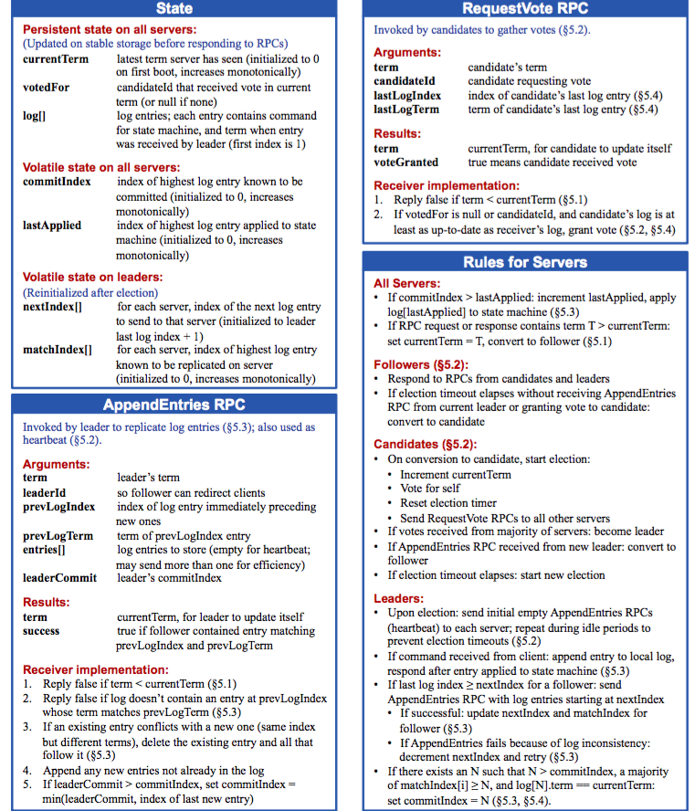
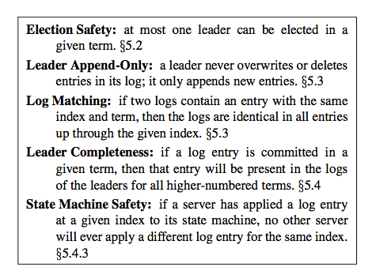
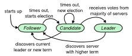
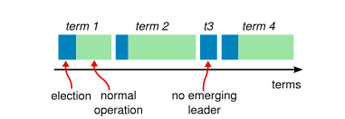
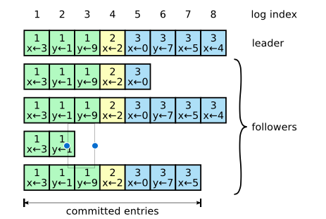

### 5 Raft 一致性算法

图表2：Raft算法的概要总结（不包括日志合并和成员变更）。server的行为在左上的图框里是一系列的规则，独立的可重复的触发。5.2章指示了哪里讨论算法的关键点。正式的说明更好地描述了算法。

图表3：Raft保证了这些属性在任何情况下都是True,章节数字指示了每一个实在什么地方讨论

Raft 算法可以管理复制日志通过第二章描述的方式。图表2总结了算法。图表3列出了算法的关键的属性。这些图标的元素会在接下来的章节中分段讨论。

Raft 实现一致性的方法是通过首先选举出leader，然后给予leader管理日志复制的所有权限。leader接受client的日志实体的请求，然后把他们复制到其它server，并告诉其它server什么时候想状态机提交日志实体是安全的。有一个leader简化了复制日志的管理。比如，leader可以不用那个询问其它server就决定在日志那个位置存放日志实体，而且数据流指示简单的从leader到其它server。leader可以挂掉或则和其他server断链，这是一个新的leader就会被选举出来。

因为有leader选举，Raft把一致性问题分解为三个近乎独立的子问题，下面讨论这些分项：

* Leader选举：当老的leader挂掉后，新的leader必须被选出来（5.2章节）
* 日志复制：leader必须从client接受日志实体，并把它们复制到集群，保证其它server的日志和它的一致（5.3章）
* 安全性：Raft的关键属性是图表3中的State Machine Safety.同一个索引上的日志只能有一个日志实体。5.4章讨论了如何实现前者。实现的方法包括5.2章描述的特使的限制机制。

介绍完一致性算法，后面的章节会介绍可用性，和定时器的作用。

#### 5.1 Raft基础

图表4。server状态follower只响应其它server的请求，如果follower没有接受到请求，他会成为一个candidate，并发起一个选。一个candidate得到大多数server的投票可以成为leader，leader不会变化之道它挂掉。

图表5.时间被分成不同的阶段，每个个阶段从选举开始。选举成功后，一个leader管理集群直到期间结束。一些选举失败了，也就没有选出leader。每个阶段的过渡期，不同的server发生在不同的时间。

一个raft集群包含好几个server，5个是典型的，可以最多容忍2个机器宕机。在任何时间，任何sever都只有三个状态，leader,follower,candidate。在正常的操作中，只有一个leader，其它的server都是follower。follower是被动的，他们自己不会产生请求，只会相应leader或candidates的请求。leader处理所有client的请求（如果client请求follower，follower重定向到leader）。第三个状态，candidates，是用来选举一个新的leader的，5.2章有描述。图表4展示了这个状态和他的过渡期，过渡期在后面讨论。

Raft把时间随意的分为不同的期限，如图表5展示的。Term被连续的数字编号。每一个Term以选举开始，在选举中，一个或多个候选人尝试成为leader，在5.2中描述了。如果一个候选人赢得了选举，在term接下来的时间里，回作为leader，有些情况下，选举或产生不一致的结果，这种情况下，term回完结，而且没有leader，一个新的term（一个新的选举）回很快产生，Raft保证最多有一个leader，在每一个term中。

不同的server，在不同的时间经历term之间的过渡期。在某些情况下，一个server可能在所有term中都不会遇到选举，在Raft中Term就像一个逻辑的钟表，它们允许server侦测到过期的leader发来的过期的信息。每一个server保存一个当前term数字，这些数字单调递增。当server交流时，当前term会相互交换。如果server发现自己的term小于其他的，会把自己的当前term更新到较大的。如果候选人或者leader，发现自己的term过期了，回立马转换到follower状态。如果一个server收到一个过期的term的请求，他会拒绝这个请求。

Raft server 使用远程程序调用（RPCs）,基本的一致性算法只需要两种类型的RPCs。RequestVote RPCs 是由候选人在选举阶段发起的（5.2章），Append-Entity RPCs是由是通过leader发起的，是为了复制日志，也是一种形式的heartbeat。第七章添加了一个新的RPC，是为了在机器间传输快照。server如果在一定时间内没有接到RPC的响应，回重试。而且为了更好地性能，他们会并行的发起RPC。

#### 5.2 Leader 选举
Raft使用心跳机制来触发leader选举。当server启动时，他们初始化作为follower，只要它从leader或者candidate接到可靠地RPCs，它会一致保持follower，Leader想所有的follower发送周期性的心跳（AppendEntity RPC 但不携带日志实体）来保持leader的权利。如果一个server超过一段时间没有收到通信，就被称为选举超时，然后它会认定这里没有可用的leader，然后开启一个选举来选择一个新的leader。

为了开启一个选举，一个follower增加他的当前term，并转换为候选人状态。然后它给自己投票，并向集群中的其它server发起一个并行的rpc的投票请求。候选人一直维持这种状态，直到一下三种情况发生：（a）它赢得了选举。（b）另一个候选人成为了leader。（c）一段时间过去了，没有winner。这些结果会在下面的章节中分开讨论。

如果这个候选人在相同的term下，赢得了整个集群的大多数投票，这个候选人后赢得选举。在一个term中一个server最多给一个候选人投票，基于先进先服务的原则（5.4章在选举中增加了一个限制）。当大多数的保证了在每一个term中最多有一个candidate赢得选举（选举安全属性，图表3）。一单candidate赢得了选举，他会成为leader，他会向其它的server发送心跳信息，建立自己的权利，并防止新的选举产生。

在等待投票结果的同时，一个候选人可能会收到追加实体的请求，是从另一个自认为leader的server发出的。如果这个leader的term（包含在rpc中）大于等译候选人的当前term，候选人把leader当成合法的，并切换到follower状态。如果rpc中的term小于候选人当前的term，候选人拒绝rpc请求，继续候选人状态。

第三种情况是，候选人在选举中没赢也没输：如果很多follower在同一时间成为candidate，选票就会分散开，也就没有candidate赢得大多数的投票。当这种情况发生时，每一个candidate都会超时，然后增加自己的term，开启下一轮的选举，发起新的rpc请求。然而没有额外的标准，这种情况可能会无限期的重复。

raft使用随机的选举超时，来保证选票分割不容易出现，即使出现也能很快的恢复。为了防止一开始就选票分散，选举超时的时间会在一个固定的时间段内随机分配（150-300ms）。这会把server铺开，大多数情况下只有一个server会超时。这个机制也被用来防止选票分割。在选举开始时，每一个candidate重启它的随机的选举超时定时器，等待时间的流逝知道开始先一个选举。这会减少下一次选举选票分裂的可能性。9.3章展示了这加快了leader的选举，

选举机制是一个例子，展示了我们如可通过可理解性来正在不同的设计选择。起初，我们是想设计一个排名系统，每一个candidate都会分配一个排名，用来在candidate竞争时选择。如果一个candidate发现另一个candidate的排名高，他就会返回到follower状态，所以高排名的的candidate可以很轻松的在下一次选举中胜利。我们发现这种方法在可用性上存在细微的问题（如果高排名的server挂掉了，一个低排名的server需要时间发现，并重新成为候选人，但是如果成为候选人太早了，就会重置leader选举的过程）。我们调整过很多次这个算法，但是每次调整都会出现新的情况。最后我们发现随机的重试更容易理解，更明显

#### 5.3 日志复制

图表6：日志是有顺序编号实体组成的。每一个实体都包含创建的term值，和状态机的命令。每一个实体都会被提交如果队里状态机来说是安全的。
